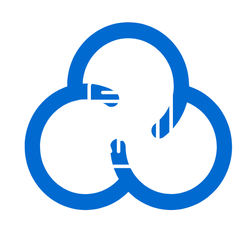
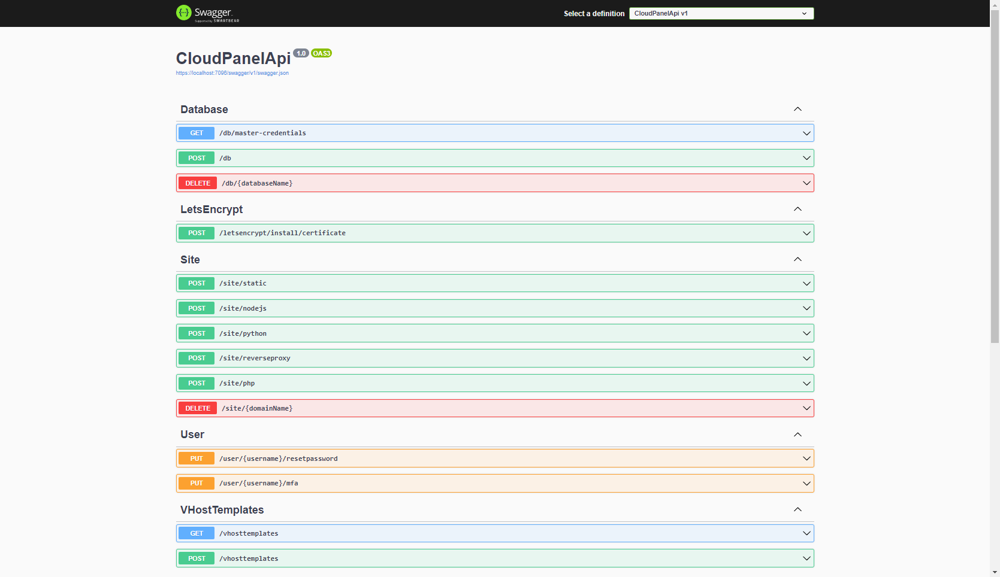

<!-- PROJECT LOGO -->
<br />
<div align="center">
  <a href="https://github.com/Endelon-Hosting/CloudPanelApi">
    
  </a>

<h3 align="center">Cloud Panel Api</h3>

  <p align="center">
    An external api server build using the coud panel cli
  </p>
</div>


<br>


### Installation


Install as systemd service **Only tested on Ubuntu 22.04 so far**
   ```sh
   sh <(curl https://raw.githubusercontent.com/Endelon-Hosting/CloudPanelApi/install.sh || wget -O - https://raw.githubusercontent.com/Endelon-Hosting/CloudPanelApi/install.sh)
   ```
Enable and start the service
   ```sh
   systemctl enable --now cpapiserver
   ```

### Configuration

API Key:

You can specify an api key by providing it using the following environment variable.

``API_KEY=<YOUR API KEY HERE>``

This can be any string. To authenticate you need to provide the api key in your requests as a bearer token

``Authorization: Bearer <YOUR API KEY HERE>``

SSH:

The cloud panel api server is also able to use remote cloud panel instances using ssh. To enable ssh mode, provide following environment variables

``SSH_HOST=<YOUR SSH HOST HERE>``

``SSH_PORT=<YOUR SSH PORT HERE>``

``SSH_USERNAME=<YOUR SSH USERNAME HERE>``

``SSH_PASSWORD=<YOUR SSH PASSWORD HERE>``

### Contributing

Contributions are what make the open source community such an amazing place to learn, inspire, and create. Any contributions you make are **greatly appreciated**.

If you have a suggestion that would make this better, please fork the repo and create a pull request. You can also simply open an issue an tell us your ideas.
Don't forget to give the project a star! Thanks ^^!